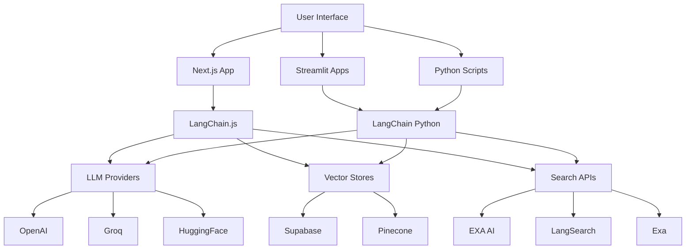

# 🦜️🔗 Enhanced LangChain Projects Collection

[](https://github.com/codespaces/new)
[](https://vercel.com/new/clone?repository-url=https%3A%2F%2Fgithub.com%2Flangchain-ai%2Flangchain-nextjs-template)

This comprehensive repository showcases a collection of AI-powered applications built with LangChain, Next.js, and various cutting-edge technologies. It serves as both a learning resource and a practical starting point for building sophisticated AI applications.

## 🚀 What's Inside

This repository contains multiple interconnected projects demonstrating different AI use cases:

### 🏠 **Core Next.js Application** (`app/` directory)
A full-featured Next.js 15 application with TypeScript showcasing multiple LangChain.js use cases:

- **🏴‍☠️ Simple Chat** (`/` route) - Basic conversational AI with streaming responses
- **🧱 Structured Output** (`/structured_output` route) - OpenAI Functions for structured data extraction
- **🦜 Agents** (`/agents` route) - Tool-using agents with EXA AI search and calculator capabilities
- **🐶 Retrieval** (`/retrieval` route) - RAG with vector store and document upload
- **🤖 Retrieval Agents** (`/retrieval_agents` route) - Agent-based RAG with complex reasoning
- **🌊 React Server Components** (`/ai_sdk` route) - AI SDK integration examples
- **🕸️ LangGraph** (`/langgraph` route) - Custom LangGraph workflow examples

**🆕 EXA AI Tools** (`app/tools/` directory):
- **ExaSearchTool**: Neural AI-powered web search
- **ExaSearchAndContentTool**: Search with full content retrieval
- **ExaAnswerTool**: Direct question answering with citations

### 🔍 **LangSearch Integration** (`langsearch/` directory)
A comprehensive search API integration project:

- **Web Search API**: Natural language search across billions of web documents
- **Rerank API**: Enhanced search result accuracy with semantic reranking
- **Python Client**: Complete API client with error handling and response validation
- **Testing Suite**: Comprehensive API testing and debugging tools
- **Documentation**: Complete setup and usage examples

**Key Features:**
- Free web search API with no credit card required
- Support for natural language queries
- Hybrid search database with semantic reranker
- Easy integration with LLM applications
- Comprehensive error handling and logging

### 🧮 **Math Assistant** (`math_assistant/` directory)
An interactive web application for mathematical problem solving:

- **Multi-Modal Input**: Text and image-based math queries
- **LaTeX-OCR**: Extract mathematical expressions from images using pix2tex
- **Symbolic Computation**: Derivatives and integrals using SymPy
- **Multiple LLM Backends**: LLaMA3 (Groq) and DeepSeek (HuggingFace)
- **LangChain Integration**: Agent orchestration for step-by-step solutions
- **LaTeX Rendering**: Beautiful mathematical expression display

**Technologies:**
- Streamlit for web interface
- LangChain for agent orchestration
- SymPy for symbolic mathematics
- pix2tex for LaTeX OCR
- Groq and HuggingFace for LLM backends

### 📚 **Q&A Chatbot** (`Q&A_Chatbot/` directory)
A document-based question answering system:

- **PDF Processing**: Upload and process PDF documents
- **Vector Database**: Pinecone integration for semantic search
- **Conversational Interface**: Chat-based Q&A with document context
- **Caching**: Optimized performance with Streamlit caching
- **Multiple LLM Support**: Flexible backend model selection

### 🌐 **Web Scraping Summarizer** (`webscraping_summarizer/` directory)
An intelligent web content analysis tool:

- **Web Scraping**: Extract content from URLs and PDFs
- **Article Summarization**: AI-powered content summarization
- **Search Integration**: Find relevant articles using Exa API
- **Multi-Format Support**: HTML, PDF, and various content types
- **Streamlit Interface**: User-friendly web application

### 🔬 **Research Agent** (`research-agent/` directory)
An autonomous academic research assistant:

- **ArXiv Integration**: Search and retrieve academic papers
- **DSPy Framework**: Advanced AI system composition
- **Paper Summarization**: AI-powered research paper summaries
- **Multi-LLM Support**: Groq and HuggingFace backends
- **Academic Focus**: Specialized for research and academic work

## 🛠️ Technology Stack

### **Core Technologies**
- **Next.js 15**: React framework with App Router
- **TypeScript**: Type safety and developer experience
- **Tailwind CSS**: Utility-first styling
- **shadcn/ui**: Modern component library
- **Vercel AI SDK**: Streaming AI responses

### **AI/LLM Stack**
- **LangChain.js**: AI application framework
- **LangGraph.js**: Agent workflow orchestration
- **OpenAI**: Primary LLM provider
- **Supabase**: Vector database
- **EXA AI**: Advanced AI-powered web search integration (replaces SERPAPI)
- **Groq**: High-performance LLM inference
- **HuggingFace**: Open-source model access

### **Additional Tools**
- **Streamlit**: Rapid web application development
- **DSPy**: Framework for building AI systems
- **SymPy**: Symbolic mathematics
- **pix2tex**: LaTeX OCR
- **Pinecone**: Vector database
- **LangSearch**: Web search API

## 🚀 Getting Started

### Prerequisites
- Node.js 18+ and Yarn
- Python 3.8+ (for Python-based projects)
- Various API keys (see individual project READMEs)

### Core Next.js Application

1. **Clone and setup:**
```bash
git clone <repository-url>
cd langchain-projects
yarn install
```

2. **Environment setup:**
```bash
cp .env.example .env.local
# Add your API keys to .env.local
```

3. **Run the development server:**
```bash
yarn dev
```

4. **Open your browser:**
Navigate to [http://localhost:3000](http://localhost:3000)

### Testing EXA AI Integration

To test the EXA AI integration:

1. **Set up your API key:**
   ```bash
   echo "EXA_API_KEY=your_exa_api_key" > .env.local
   ```

2. **Run the test:**
   ```bash
   npx tsx app/test-exa-integration.ts
   ```

3. **Test the agents endpoint:**
   ```bash
   curl -X POST http://localhost:3000/api/chat/agents \
     -H "Content-Type: application/json" \
     -d '{"messages":[{"role":"user","content":"What are the latest AI developments?"}]}'
   ```

### Python-Based Projects

Each Python project has its own setup instructions. Navigate to the project directory and follow the README:

```bash
# Math Assistant
cd math_assistant
pip install -r requirements.txt
streamlit run app.py

# Research Agent
cd research-agent/autonomous_agent
pip install -r requirements.txt
streamlit run main.py

# Q&A Chatbot
cd Q&A_Chatbot
pip install -r requirements.txt
streamlit run app.py

# Web Scraping Summarizer
cd webscraping_summarizer
pip install -r requirements.txt
streamlit run app.py
```

## 🔧 Configuration

### Environment Variables

Create `.env.local` for the Next.js app and individual `.env` files for Python projects:

```env
# Core Application
OPENAI_API_KEY=your_openai_key
EXA_API_KEY=your_exa_api_key
SUPABASE_URL=your_supabase_url
SUPABASE_PRIVATE_KEY=your_supabase_key

# LangSearch
LANGSEARCH_API_KEY=your_langsearch_key

# Math Assistant
GROQ_API_KEY=your_groq_key
HF_TOKEN=your_huggingface_token

# Research Agent
GROQ_API_KEY=your_groq_key
HF_MODEL_ID=google/flan-t5-large
```

### 🆕 EXA AI Integration

This project now uses **EXA AI** for advanced web search capabilities, replacing the previous SERPAPI integration. EXA AI provides:

- **Neural Search**: AI-powered search that understands context and intent
- **Content Retrieval**: Get full text content from search results  
- **Direct Answers**: Get grounded answers to questions with citations
- **Autoprompt**: Automatic query optimization for better results

**Setup EXA AI:**
1. Visit [https://exa.ai](https://exa.ai) and sign up for an account
2. Get your API key from the dashboard
3. Add `EXA_API_KEY=your_exa_api_key` to your `.env.local` file

**Available Tools:**
- `ExaSearchTool`: Basic web search with neural capabilities
- `ExaSearchAndContentTool`: Search with full content retrieval
- `ExaAnswerTool`: Direct answers to questions with citations

For detailed migration information, see [MIGRATION_GUIDE.md](MIGRATION_GUIDE.md).

## 📊 Bundle Size

The Next.js application is optimized for Vercel's free tier. LangChain uses only 37.32 KB of code space after compression, which is less than 4% of the 1 MB edge function limit.

Analyze the bundle size:
```bash
ANALYZE=true yarn build
```

## 🎯 Use Cases Demonstrated

### **Conversational AI**
- Simple chatbots with streaming responses
- Structured data extraction using OpenAI Functions
- Tool-using agents with EXA AI search and calculation capabilities

### **Retrieval Augmented Generation (RAG)**
- Document-based question answering
- Vector store integration with Supabase
- Agent-based retrieval with complex reasoning
- Web search integration with LangSearch

### **Mathematical Computing**
- Symbolic mathematics with SymPy
- LaTeX OCR for image-based math input
- Multi-LLM backend support
- Step-by-step problem solving

### **Research and Analysis**
- Academic paper search and summarization
- Web content scraping and analysis
- Autonomous research workflows
- Multi-source information synthesis

### **Search and Discovery**
- Neural AI-powered web search with EXA AI
- Content retrieval and direct question answering
- Semantic reranking of results
- API integration examples
- Comprehensive testing suites

## 🚀 EXA AI Migration Benefits

The migration from SERPAPI to EXA AI provides significant improvements:

| Feature | Before (SERPAPI) | After (EXA AI) |
|---------|------------------|----------------|
| **Search Quality** | Basic keyword matching | AI-powered neural search |
| **Content Access** | Limited snippets | Full text content |
| **Query Understanding** | Literal matching | Context-aware understanding |
| **Answer Generation** | No | Direct answers with citations |
| **Query Optimization** | Manual | Automatic (autoprompt) |
| **Result Relevance** | Variable | Consistently high |

## 🏗️ Architecture Overview



## 📚 Learning Resources

### **Documentation**
- [LangChain.js Documentation](https://js.langchain.com/docs/)
- [LangGraph.js Tutorials](https://langchain-ai.github.io/langgraphjs/)
- [Vercel AI SDK](https://sdk.vercel.ai/docs)
- [Streamlit Documentation](https://docs.streamlit.io/)
- [EXA AI Documentation](https://docs.exa.ai)

### **Project-Specific Documentation**
- [EXA AI Migration Guide](MIGRATION_GUIDE.md) - Complete migration from SERPAPI to EXA AI
- [EXA AI Tools Documentation](app/tools/README.md) - Detailed tool usage and examples
- [EXA AI Migration Summary](EXA_AI_MIGRATION_SUMMARY.md) - Overview of all changes

### **Key Concepts**
- **LangChain Expression Language**: Composing AI workflows
- **Agent Architectures**: Tool-using AI systems
- **RAG Patterns**: Retrieval augmented generation
- **Vector Databases**: Semantic search and storage
- **Multi-Modal AI**: Text, image, and structured data processing
- **Neural Search**: AI-powered web search with context understanding

## 🚀 Deployment

### **Next.js Application**
Deploy to Vercel with one click:
[](https://vercel.com/new/clone?repository-url=https%3A%2F%2Fgithub.com%2Flangchain-ai%2Flangchain-nextjs-template)

### **Python Applications**
Deploy Streamlit apps to:
- [Streamlit Cloud](https://streamlit.io/cloud)
- [Heroku](https://heroku.com/)
- [Railway](https://railway.app/)
- [Render](https://render.com/)

## 🤝 Contributing

1. Fork the repository
2. Create a feature branch (`git checkout -b feature/amazing-feature`)
3. Commit your changes (`git commit -m 'Add amazing feature'`)
4. Push to the branch (`git push origin feature/amazing-feature`)
5. Open a Pull Request

## 📄 License

This project is licensed under the MIT License - see the [LICENSE](LICENSE) file for details.

## 🙏 Acknowledgments

- Built with ❤️ using LangChain, Next.js, and Streamlit
- Inspired by the open-source AI community
- Special thanks to LangChain AI, Vercel, and all contributors

---

**Note**: This enhanced repository demonstrates the power of combining multiple AI technologies to create sophisticated applications. Each project can be used independently or as part of a larger AI ecosystem.
